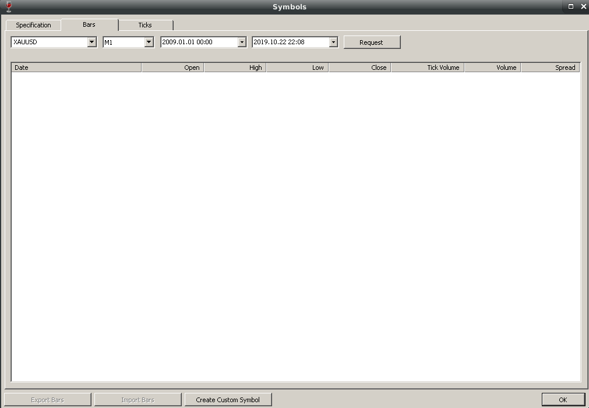
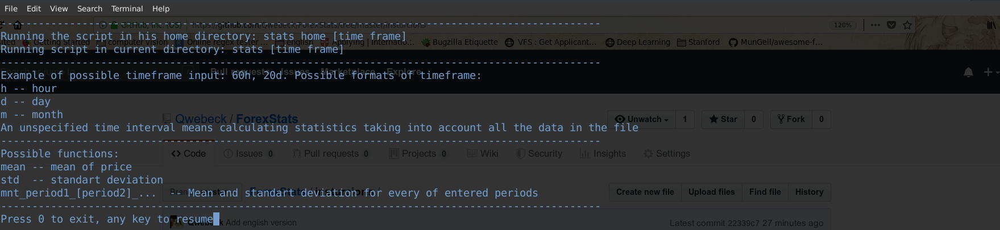
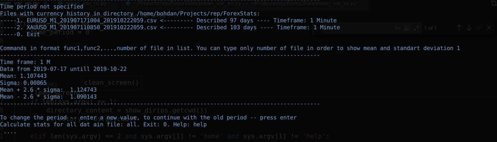
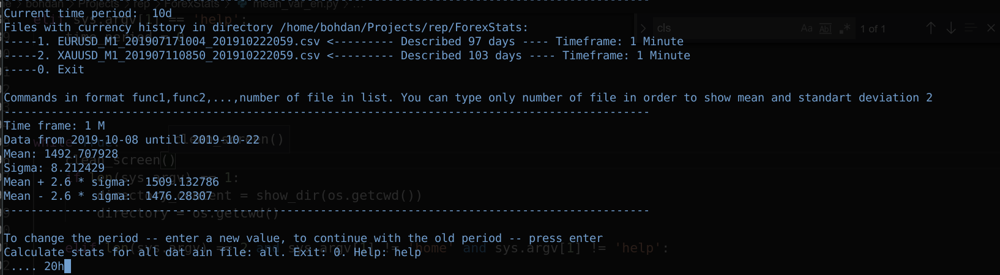
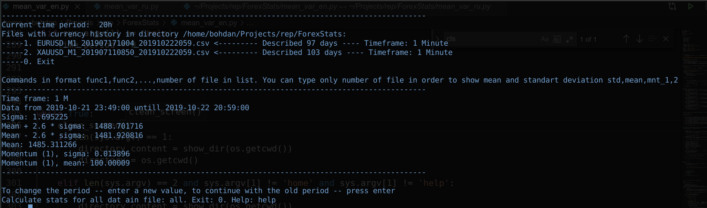

# ForexStats
This script works properly **only** for historical currency data from MT4 and MT5 ! :shipit:
<h1>Description</h1>
Script created for calculating statistics such as mean and standart deviation for closed price and momentum parameters. 
The goal is to provide user with information that can help him to better understand how price behaved in chosen period. 
To get historical data in Meta Trader 5:

- Open `View` menu on you toolbar and choose `Symbols`. You also can press `Ctrl+U`
 - After that open `Bars` section
 - You should see something like 

- In first field you can choose symbol, in second you can choose timeframe you are interested in, in third type data from where you want to start copying, in fourth -- data where to stop
- Then press button `Export Bars` and choose your directory. It will be a good choise to choose a directory where this script is stored

<h1>Work example</h1>
In below secion there will be shown some an example of script work.

1. You can always ask for help by calling script with next command `python mean_var_VERSION.py help`. Output will be as follows

2. To calculate mean and deviation for all data just run script without passing any options. 
That could be done with command `python mean_var_VERSION.py`
You will see next output, where will be listed all .csv files in your current directory.

3. Than just type number of file for which you want to calculate mean and std and press `enter`.
4. After every calculation there will appear three dots. If you want to change period you should type a new one in allowed format.
Allowed format you can check in help menu.Below is an example of changing period:

5. If you want to change stats that will be calculated, for example calculate only mean, or only standart deviation -- you should pass function names you want to use separated by comma. 
Available functions you could check by typing help.
Below is an example of such execution

